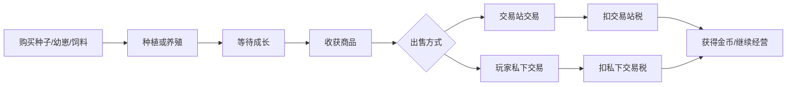

# 0001 - 初始产品与技术落地方案

## 当前已有

当前仓库处于初始阶段，尚未发现已有代码、数据库脚本或产品文档。

本阶段已确定项目方向：

- 类型：农场牧场经营类金融游戏。
- 首发形态：网页版本。
- 阶段目标：先完善产品文档、原型、可行性验证和核心功能测试。
- 技术栈：Vue 3 + Vite + Pinia + ECharts、Spring Boot、PostgreSQL、Redis。

## 本次完成

本次新增本地文档体系，并完成第一版产品与技术落地方案：

- 建立 `docs/README.md`，说明文档库用途和当前技术栈。
- 建立 `docs/reference/documentation-policy.md`，定义后续只增不改的版本文档规则。
- 建立本文档，作为第一个版本快照。
- 明确 MVP、V1、V2 三个版本建议。
- 明确核心玩法、交易税、价格浮动、私下交易、大宗令牌、多用户并发等关键设计。
- 明确初始页面原型结构和实际落地模块。

## 产品定位

产品不是单纯的种菜收菜游戏，而是“农牧经营 + 商品市场 + 玩家交易 + 税收治理 + 经济风控”的经营类金融游戏。

玩家通过购买种子、幼崽、饲料等资产，在农场或牧场中等待成长并收获商品。收获后的商品可以进入交易站交易，也可以进行玩家私下交易。交易站价格根据近期成交量和成交额动态浮动，系统从交易中抽取税收。管理员可以配置税率、商品参数和部分市场规则。

核心体验目标：

- 经营感：土地、牧场、仓库、成长等待、产出规划。
- 交易感：行情涨跌、成交量、买卖选择、税费计算。
- 策略感：选择种什么、养什么、何时出售、是否囤货。
- 治理感：税率、市场熔断、大宗权限、异常交易审计。

## 核心玩法闭环



## MVP 版本建议

MVP 用于验证玩法成立，不追求完整金融深度。

建议包含：

- 用户注册、登录、基础账户。
- 玩家金币余额。
- 商品配置：种子、幼崽、收获物。
- 农场土地和牧场栏位。
- 种植、养殖、倒计时、收获。
- 仓库库存。
- 交易站即时买入、卖出。
- 交易站税率，默认 3%，管理员可配置。
- 私下交易报价单，默认税率 5%，管理员可配置。
- 大宗交易令牌基础校验。
- 交易流水、资产流水、税收流水。
- 管理后台基础配置。

MVP 暂不建议包含：

- 复杂撮合引擎。
- 衍生品或合约玩法。
- 跨区套利。
- 公会经济。
- 真实货币充值提现。

## V1 可运营版本建议

V1 用于小规模真实用户测试。

建议增加：

- 买单、卖单、订单簿和撮合。
- 最近成交价、成交量、K 线或折线行情。
- ECharts 行情图。
- 价格涨跌幅限制。
- 市场异常波动熔断。
- 大宗令牌的额度、次数、有效期和品类限制。
- 仓库扩容、土地扩建、牧场扩建。
- 每日任务、新手引导、经营目标。
- 后台风控看板。
- 管理员操作审计。

## V2 深度策略版本建议

V2 用于增强长期留存和复杂经济系统。

建议增加：

- 多区域市场和运输成本。
- 季节、天气、病虫害、产量波动。
- 商品保质期和仓储费。
- 合作社或公会。
- 订单保险、运输保险。
- 市场做市参数。
- 更复杂的反作弊模型。
- 移动端或小程序适配。

## 交易与价格规则

交易站价格不能只由最后一笔成交决定，否则容易被小号操纵。

建议使用近期成交的加权平均价格和成交量调整：

```text
成交均价 = 最近 N 分钟成交额 / 最近 N 分钟成交量
成交量系数 = 最近成交量 / 基准成交量
库存压力 = 当前卖单量 / 当前买单量
新参考价 = 当前参考价 * (1 + 需求影响 - 供给影响 + 稀缺影响)
```

必须加入保护：

- 单次价格变化上限。
- 每小时或每日涨跌幅上限。
- 最小成交量要求。
- 低成交量时向官方基础价缓慢回归。
- 异常成交触发熔断。
- 关联账号成交不计入或降低权重。

## 税收规则

初始税率：

- 交易站税率：3%。
- 私下交易税率：5%。
- 大宗交易税率：可独立配置，MVP 可先沿用交易类型税率。

管理员可配置税率，但必须记录：

- 修改人。
- 修改前税率。
- 修改后税率。
- 生效时间。
- 修改原因。

税收需要进入系统税收账户或税收流水，不能只在交易中简单扣除而不留账。

## 大宗交易令牌

大宗交易不能只是一个用户权限开关，建议令牌具备以下属性：

- 令牌编号。
- 持有人。
- 可交易品类。
- 单笔额度。
- 总额度。
- 可用次数。
- 有效期。
- 是否可转让。
- 使用状态。

大宗交易判定可以按数量或金额触发：

```text
如果交易数量 >= 商品大宗数量阈值
或交易金额 >= 大宗金额阈值
则需要大宗交易令牌
```

## 并发与一致性要求

多用户并发是项目核心风险之一。所有关键操作必须以后端事务为准，不能依赖前端判断。

必须使用数据库事务处理：

- 购买商品。
- 播种或养殖。
- 收获。
- 创建交易单。
- 交易站买入卖出。
- 私下交易确认。
- 取消订单。
- 使用大宗令牌。

必须防止：

- 同一库存被卖两次。
- 同一土地重复收获。
- 余额扣款成功但库存未增加。
- 税收扣除和交易成交不一致。
- 订单取消与订单成交同时发生。

## 风险与漏洞清单

已识别风险：

- 重复收获漏洞。
- 重复卖出库存漏洞。
- 小号刷成交量操纵价格。
- 私下交易绕过税收。
- 管理员暗改税率或发放资产。
- 高频脚本刷操作。
- 通货膨胀导致金币贬值。
- 价格暴涨暴跌导致新用户被收割。
- 大宗令牌被滥用或转卖。
- Redis 锁失效导致并发穿透。

建议防护：

- 所有资产变化写入资产流水。
- 所有交易写入交易流水。
- 管理员操作写入审计日志。
- 后端接口做幂等键。
- 数据库使用行锁或乐观锁。
- Redis 只做辅助锁，不能替代数据库事务。
- 对高频交易、异常价格、关联账号交易做风控。

## 初始页面原型

### 仪表盘

展示玩家核心状态：

- 金币余额。
- 仓库容量。
- 土地数量。
- 牧场栏位。
- 当前税率。
- 今日市场涨跌。
- 成长中的作物和动物。
- 今日任务。

### 农场牧场页

展示土地网格和牧场栏位：

- 空地可播种。
- 成长中显示倒计时。
- 成熟后可收获。
- 栏位不足时引导扩建。
- 右侧显示预计产出、成本、预计市场收益。

### 交易站页

展示市场交易：

- 商品列表。
- 当前价。
- 涨跌幅。
- 最近成交量。
- ECharts 行情图。
- 买入卖出面板。
- 税费预估。
- 是否触发大宗交易。

### 私下交易页

展示玩家间报价单：

- 选择交易对象。
- 选择商品和数量。
- 设置对方支付金币。
- 显示市场参考价。
- 显示私下交易税费。
- 大宗令牌校验。
- 双方确认后成交。

### 管理后台

展示运营和风控：

- 税率配置。
- 商品基础价配置。
- 成长时间配置。
- 产量配置。
- 大宗阈值配置。
- 市场波动上限配置。
- 税收统计。
- 异常交易列表。
- 管理员操作日志。

## 技术落地方案

### 前端

技术栈：

- Vue 3
- Vite
- Pinia
- Vue Router
- ECharts

建议前端模块：

- `auth`：登录注册。
- `dashboard`：经营总览。
- `farm`：土地、作物、收获。
- `ranch`：牧场、动物、产出。
- `inventory`：仓库库存。
- `market`：交易站、行情图。
- `private-trade`：私下交易报价单。
- `admin`：后台管理。

### 后端

技术栈：

- Spring Boot
- Spring Security
- Spring Data JPA 或 MyBatis Plus
- PostgreSQL
- Redis

建议后端模块：

- 用户与权限模块。
- 商品配置模块。
- 农场牧场模块。
- 库存模块。
- 交易站模块。
- 私下交易模块。
- 税收模块。
- 大宗令牌模块。
- 行情模块。
- 后台管理模块。
- 审计与风控模块。

### PostgreSQL

PostgreSQL 负责强一致性数据：

- 用户。
- 账户余额。
- 商品配置。
- 土地与牧场栏位。
- 库存。
- 订单。
- 成交。
- 税收流水。
- 资产流水。
- 管理员审计。

关键表建议增加：

- `version` 字段做乐观锁。
- `created_at`、`updated_at`。
- `status` 状态字段。
- 金额使用整数最小单位，不用浮点数。

### Redis

Redis 负责辅助能力：

- 行情缓存。
- 排行榜。
- 接口限流。
- 短期幂等键。
- WebSocket 在线状态。
- 后台统计缓存。

Redis 不应作为资产最终账本。

## 初始数据模型草案

核心表：

- `users`：玩家账号。
- `wallets`：玩家钱包。
- `items`：商品定义。
- `player_inventory`：玩家库存。
- `farm_plots`：农场土地。
- `ranch_slots`：牧场栏位。
- `growth_instances`：成长实例。
- `market_orders`：交易站订单。
- `market_trades`：交易站成交。
- `private_trade_offers`：私下交易报价。
- `tax_records`：税收记录。
- `asset_ledger`：资产流水。
- `bulk_trade_tokens`：大宗交易令牌。
- `admin_audit_logs`：管理员审计日志。
- `market_price_snapshots`：行情快照。

## 初始接口草案

玩家接口：

- `POST /api/auth/register`
- `POST /api/auth/login`
- `GET /api/dashboard`
- `GET /api/farm/plots`
- `POST /api/farm/plots/{id}/plant`
- `POST /api/farm/plots/{id}/harvest`
- `GET /api/ranch/slots`
- `POST /api/ranch/slots/{id}/raise`
- `POST /api/ranch/slots/{id}/collect`
- `GET /api/inventory`
- `GET /api/market/items`
- `GET /api/market/items/{id}/chart`
- `POST /api/market/orders`
- `POST /api/private-trades`
- `POST /api/private-trades/{id}/accept`
- `POST /api/private-trades/{id}/cancel`

后台接口：

- `GET /api/admin/config/taxes`
- `PUT /api/admin/config/taxes`
- `GET /api/admin/items`
- `POST /api/admin/items`
- `PUT /api/admin/items/{id}`
- `GET /api/admin/risk/trades`
- `GET /api/admin/audit-logs`

## 建议开发顺序

1. 初始化前后端项目结构。
2. 建立 PostgreSQL 表结构和基础迁移脚本。
3. 实现用户、钱包、库存、资产流水。
4. 实现商品配置、土地、种植、收获。
5. 实现交易站基础买卖和税收。
6. 实现私下交易报价单。
7. 加入行情图和价格浮动。
8. 加入管理员配置。
9. 加入并发测试和重复交易测试。
10. 加入风控与审计。

## 下次待做

建议下一阶段新增 `0002` 版本文档，并完成以下内容之一：

- 方案 A：初始化 Vue 3 + Vite + Pinia + ECharts 前端项目骨架。
- 方案 B：初始化 Spring Boot + PostgreSQL + Redis 后端项目骨架。
- 方案 C：先补充更详细的数据库 ER 模型和 SQL 迁移脚本。
- 方案 D：先做静态高保真网页原型，验证页面结构和交互体验。

推荐下一步选择方案 A + D：先做前端可视化原型，尽快看到游戏是否有感觉，同时不阻塞后端架构设计。

